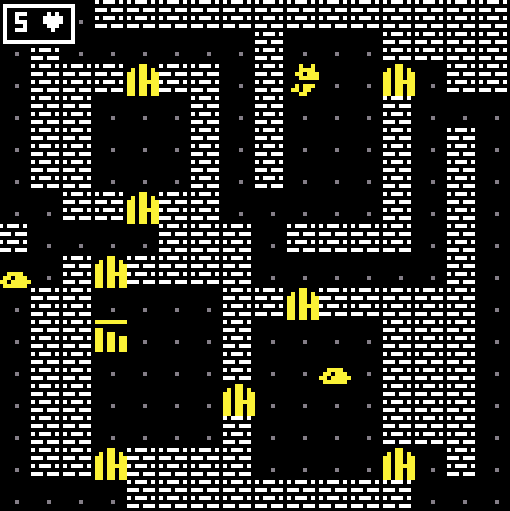

# Dungeon diver

## Overview

This is a work in progress game in which you have to find as much treasure as possible by going in the depth of a treacherous dungeon, only the strongest survive.

### Disclaimer: 

The game is inspired by the series of [LazyDevs](https://www.youtube.com/c/LazyDevs) on the game PorkLike, at the moment some of the sprites are inspired heavily by his game, that will change with time as I start working on the graphics.

## Screenshots



## Dependencies

- mingw32-make \ make
- cmake
- sfml (installed with bat files)

## How to build

The only supported platform for the install script is windows, you can also install on linux, but you will have to manually build SFML.

You can install the sfml library using the bat file in the source dir. Also you can modify it, if you are using gnu win32 make instead of mingw32-make, or for any other reason.

```
cd dungeon-diver
./install.bat
```

Then you will be able to generate the build files, and build the project:

```
cd build
cmake ..
cmake --build .
```

Note: you should be able to use any generator with cmake (-G).

## Working on

- [X] User interface
- [ ] Better enemy ai (pathfinding)
- [ ] Inventory and items
- [ ] Refactor the map generator and finish it
- [ ] Visual effects and juice
    - [ ] UI effects
    - [ ] Hit effects for enemies
    - [ ] Fog of war and light
- [X] State management
- [ ] General refactoring
    - [ ] Refactoring the game and world classes
    - [ ] "Refactor" project directory structure